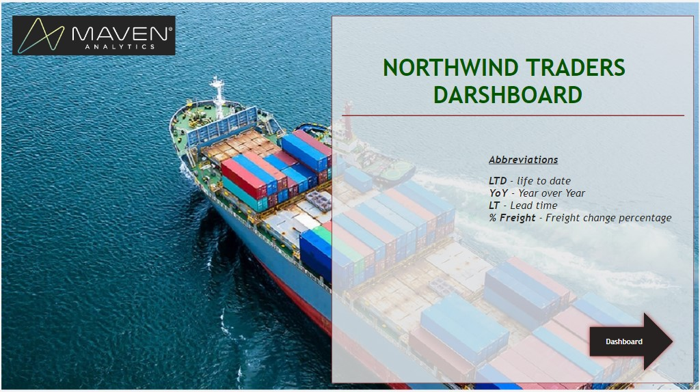
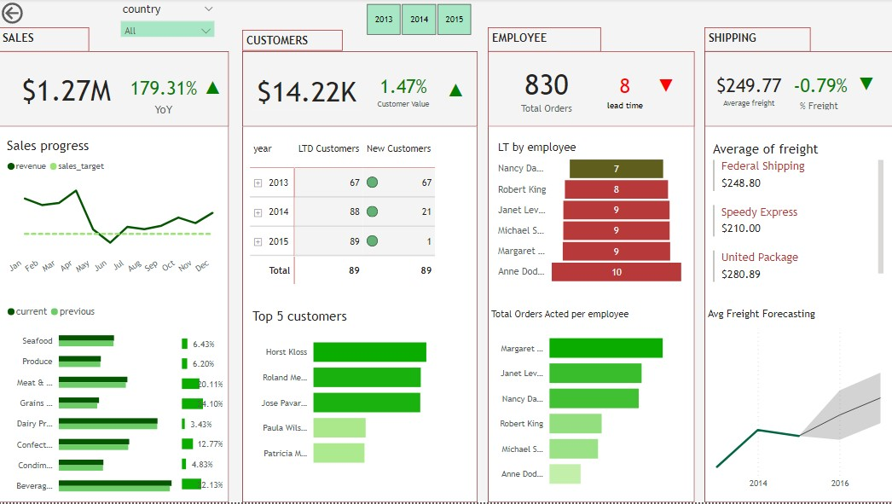

# NORTHWIND TRADERS DASHBOARD
For the Maven Northwind Challenge, you'll be working as a BI Developer for Northwind Traders, a global import and export company that specializes in supplying high-quality gourmet food products to restaurants, cafes, and specialty food retailers around the world.

## Tasks
* Building a top-level KPI dashboard for the executive team with the purpose to allow them to quickly understand the company's performance in key areas, including Sales trends, Product performance, Key customers, and Shipping costs
* To give insights and recommendations to the VPs.

## Approach
According to the data given, the dashboard will show performance in sales, customers, employee, and shipping segments. The performance was evaluated in two ways;

a) By comparing the current situation with the previous one
* Sales of products in current month vs. previous month
* Customer value in current month vs. previous
* Average Freight change in current quarter vs. previuos 

b) By developing KPI's and measuring against them    
* Sale KPI - $60,000 per month
* Customer KPI - 1 new customer per month
* Employee KPI - 7 days lead time per order

## Visualization
**Click the image to interact**

## Insights
* Sales have dropped compared to January to April sales
* Products in beverages and dairy products categories have high sales while grain & cereal, produce, and condiments products have poor sales
* Number of new customers have been dropping from year to year. 2013 had 67 new customers and 2014 had 21 new customers
* Customer value has increased by 1.47%
* Average lead time is below the target, 8 days of lead time per order
* Speedy express have lower average shipping cost compared to others
* Average shipping cost is expected to rise to $282.36 from $249.77

## Recommendations
* Reconstruct Marketing strategy. Sales have dropped, number of new customers is declining. The management have to reconstruct the marketing strategy to return on truck
* The should consider to use speedy express because they have low average freight and the cost is expected to rise in the next year.
